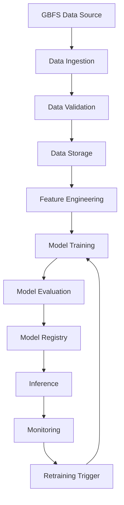

# MLOps GBFS Bike-Sharing Forecasting

Repositori ini merupakan fondasi teknis proyek MLOps untuk memprediksi ketersediaan sepeda dan slot dok pada sistem bike-sharing menggunakan data General Bikeshare Feed Specification (GBFS).

## Latar Belakang

Sistem bike-sharing menghadapi ketidakseimbangan distribusi sepeda antarstasiun. Pada waktu tertentu, sebuah stasiun dapat kehabisan sepeda, sedangkan stasiun lain dapat penuh sehingga tidak memiliki slot kosong untuk pengembalian.

Informasi prediktif diperlukan agar operator dapat melakukan rebalancing sebelum kegagalan layanan terjadi. Proyek ini dirancang untuk mengembangkan sistem yang memprediksi kondisi stasiun dalam waktu 30 menit ke depan serta dapat diperbarui ketika pola data berubah.

## Tujuan Proyek

Proyek ini bertujuan untuk:

1. Mengumpulkan data ketersediaan stasiun secara berkala dari GBFS.
2. Memprediksi jumlah sepeda tersedia dan slot dok kosong 30 menit ke depan.
3. Mengidentifikasi stasiun yang berpotensi kosong atau penuh.
4. Mengevaluasi model menggunakan skema validasi deret waktu.
5. Menyiapkan mekanisme monitoring dan continuous training pada tahap berikutnya.
6. Menjaga proses pengembangan tetap reproducible melalui GitHub Codespaces.

## Machine Learning Task

Task utama proyek adalah time-series forecasting pada level stasiun.

| Komponen           | Deskripsi                                                                            |
| ------------------ | ------------------------------------------------------------------------------------ |
| Input              | Riwayat ketersediaan sepeda, slot dok, waktu, kapasitas stasiun, dan fitur pendukung |
| Target utama       | Jumlah sepeda dan slot dok yang tersedia                                             |
| Forecast horizon   | 30 menit ke depan                                                                    |
| Unit prediksi      | Setiap stasiun bike-sharing                                                          |
| Metrik teknis      | MAE dan RMSE                                                                         |
| Output operasional | Kondisi kosong, normal, atau penuh                                                   |

Pada tahap selanjutnya, hasil regresi dapat diterjemahkan menjadi kelas operasional untuk membantu menentukan prioritas rebalancing.

## Sumber Data

Data utama direncanakan berasal dari feed real-time Citi Bike yang menggunakan standar GBFS.

Discovery endpoint:

```text
https://gbfs.citibikenyc.com/gbfs/2.3/gbfs.json
```

Feed utama yang digunakan adalah:

| Feed                  | Kegunaan                                                    |
| --------------------- | ----------------------------------------------------------- |
| `station_information` | Identitas, nama, koordinat, dan kapasitas stasiun           |
| `station_status`      | Jumlah sepeda tersedia, slot kosong, dan status operasional |
| Trip history          | Informasi perjalanan historis sebagai data pendukung        |

Data mentah tidak disimpan dalam Git karena ukurannya dapat terus bertambah. Direktori data tetap disediakan untuk menjaga struktur proyek.

## Rencana Pipeline MLOps



Pipeline tersebut merupakan rancangan pengembangan jangka panjang. Implementasi pada tahap saat ini berfokus pada standardisasi repository dan lingkungan pengembangan.

## Struktur Repository

```text
MLOps-GBFS-Bike-Sharing/
├── .devcontainer/
│   └── devcontainer.json
├── config/
├── data/
│   ├── external/
│   ├── interim/
│   ├── processed/
│   └── raw/
├── models/
├── notebooks/
├── reports/
│   └── figures/
├── src/
├── .gitignore
├── LICENSE
├── README.md
└── requirements.txt
```

Penjelasan setiap direktori:

| Direktori          | Fungsi                                               |
| ------------------ | ---------------------------------------------------- |
| `.devcontainer/`   | Konfigurasi environment GitHub Codespaces            |
| `config/`          | Parameter data, eksperimen, training, dan monitoring |
| `data/raw/`        | Snapshot asli yang diperoleh dari sumber data        |
| `data/interim/`    | Data yang telah melalui pemrosesan sementara         |
| `data/processed/`  | Data yang sudah siap digunakan untuk training        |
| `data/external/`   | Data eksternal, misalnya cuaca atau kalender         |
| `models/`          | Model, checkpoint, dan metadata hasil training       |
| `notebooks/`       | Notebook untuk EDA dan eksperimen                    |
| `reports/figures/` | Grafik dan visualisasi hasil analisis                |
| `src/`             | Source code reusable untuk pipeline proyek           |

File berukuran besar pada `data/` dan `models/` tidak dilacak oleh Git. File `.gitkeep` digunakan agar struktur direktorinya tetap tersedia.

## Development Environment

Proyek menggunakan GitHub Codespaces untuk menyediakan lingkungan pengembangan yang konsisten.

Konfigurasi utama berada pada:

```text
.devcontainer/devcontainer.json
```

Environment yang digunakan:

| Komponen              | Konfigurasi                     |
| --------------------- | ------------------------------- |
| Base image            | Microsoft Dev Containers Python |
| Python                | 3.11                            |
| Dependency manager    | pip                             |
| Dependency definition | `requirements.txt`              |
| Notebook environment  | JupyterLab                      |
| Code quality          | Ruff                            |
| Testing framework     | pytest                          |

Ekstensi Visual Studio Code yang dipasang otomatis:

* Python
* Pylance
* Jupyter
* Ruff
* YAML

Dependency Python akan dipasang otomatis melalui `postCreateCommand` ketika Codespace dibuat atau container dibangun ulang.

## Menjalankan Proyek dengan GitHub Codespaces

### 1. Membuka repository

Buka halaman repository berikut:

```text
https://github.com/Zeropeepo/MLOps-GBFS-Bike-Sharing
```

### 2. Membuat Codespace

1. Pilih tombol **Code**.
2. Buka tab **Codespaces**.
3. Pilih **Create codespace on main**.
4. Tunggu proses pembuatan container dan instalasi dependency selesai.
5. Visual Studio Code versi web akan terbuka setelah environment siap.

### 3. Memeriksa versi Python

Buka terminal Codespaces, kemudian jalankan:

```bash
python --version
```

Environment yang benar akan menampilkan Python 3.11.

### 4. Memeriksa dependency

Jalankan:

```bash
pip check
```

Jika konfigurasi berhasil, output yang diharapkan adalah:

```text
No broken requirements found.
```

### 5. Memeriksa library utama

```bash
python -c "import pandas, sklearn, jupyterlab; print('Environment ready')"
```

Output yang diharapkan:

```text
Environment ready
```

### 6. Memeriksa kualitas source code

```bash
ruff check .
```

Perintah ini memeriksa kesalahan dasar dan konsistensi source code Python.

### 7. Membuka JupyterLab

Jupyter Notebook dapat dibuka langsung menggunakan ekstensi Jupyter pada Codespaces. Alternatifnya, jalankan:

```bash
jupyter lab
```

Codespaces akan mendeteksi port Jupyter dan menawarkan akses melalui browser.

## Membangun Ulang Codespace

Container perlu dibangun ulang apabila terjadi perubahan pada:

* `.devcontainer/devcontainer.json`;
* versi Python;
* `requirements.txt`;
* ekstensi Visual Studio Code;
* perintah instalasi environment.

Langkah rebuild:

1. Tekan `Ctrl + Shift + P`.
2. Cari `Codespaces: Rebuild Container`.
3. Pilih perintah tersebut.
4. Tunggu instalasi dependency selesai.
5. Jalankan kembali `python --version` dan `pip check`.

## Menjalankan secara Lokal

Selain melalui Codespaces, repository dapat dijalankan secara lokal menggunakan Python 3.11.

Clone repository:

```bash
git clone https://github.com/Zeropeepo/MLOps-GBFS-Bike-Sharing.git
cd MLOps-GBFS-Bike-Sharing
```

Buat virtual environment:

```bash
python -m venv .venv
```

Aktifkan pada Linux atau macOS:

```bash
source .venv/bin/activate
```

Aktifkan pada Windows PowerShell:

```powershell
.venv\Scripts\Activate.ps1
```

Instal dependency:

```bash
python -m pip install --upgrade pip
pip install -r requirements.txt
```

Validasi instalasi:

```bash
pip check
python -c "import pandas, sklearn, jupyterlab; print('Environment ready')"
```

## GitHub Flow

Proyek menggunakan GitHub Flow agar perubahan tidak langsung dilakukan pada branch stabil.

Alur yang digunakan:

1. Memperbarui branch `main`.
2. Membuat branch baru untuk satu pekerjaan atau eksperimen.
3. Melakukan perubahan pada branch tersebut.
4. Membuat commit dengan pesan yang informatif.
5. Push branch ke GitHub.
6. Membuat pull request menuju `main`.
7. Melakukan validasi dan meninjau perubahan.
8. Merge pull request setelah validasi berhasil.
9. Menghapus branch yang sudah selesai.

Contoh:

```bash
git switch main
git pull origin main
git switch -c feat/initial-eda
```

Setelah perubahan dibuat:

```bash
git add .
git commit -m "docs(eda): add initial exploratory analysis plan"
git push -u origin feat/initial-eda
```

Perubahan kemudian diajukan melalui pull request dari `feat/initial-eda` menuju `main`.

Branch `main` diperlakukan sebagai versi stabil, sedangkan branch `feat/*` digunakan untuk pengembangan fitur atau eksperimen.

## Reproducibility

Reproducibility diterapkan melalui:

* penggunaan Python 3.11 yang didefinisikan pada `devcontainer.json`;
* dependency dengan versi spesifik pada `requirements.txt`;
* instalasi dependency secara otomatis;
* struktur direktori yang konsisten;
* konfigurasi proyek yang dipisahkan dari source code;
* data dan model berukuran besar tidak disimpan langsung di Git;
* perubahan proyek dilacak melalui branch, commit, dan pull request.

Dengan pendekatan ini, pengguna lain dapat membuka repository melalui Codespaces dan memperoleh environment yang sama tanpa melakukan konfigurasi manual dari awal.

## Status Proyek

Proyek saat ini berada pada tahap inisialisasi fondasi MLOps.

Komponen yang telah disiapkan:

* [x] Repository GitHub
* [x] `.gitignore` khusus Python dan proyek MLOps
* [x] Lisensi MIT
* [x] Struktur direktori
* [x] Konfigurasi GitHub Codespaces
* [x] Dependency pengembangan
* [x] Rencana initial EDA
* [x] Penerapan GitHub Flow

Komponen yang direncanakan pada tahap berikutnya:

* [ ] Pengambilan snapshot GBFS
* [ ] Validasi data
* [ ] Initial exploratory data analysis
* [ ] Pengumpulan data terjadwal
* [ ] Feature engineering
* [ ] Baseline forecasting
* [ ] Evaluasi deret waktu
* [ ] Model registry
* [ ] Monitoring data dan model
* [ ] Continuous training
* [ ] Inference service

## Lisensi

Source code proyek ini menggunakan [Apache-2.0 license](LICENSE).

Data Citi Bike dan sumber data eksternal lainnya tetap mengikuti ketentuan penggunaan dari masing-masing penyedia data.
