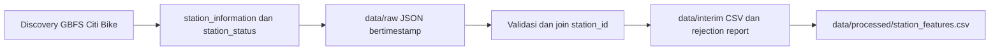

# Panduan Ingestion dan Preprocessing GBFS

Dokumen ini menjelaskan cara menjalankan skrip data, alur kerjanya, dan cara
menganalisis hasilnya. Gunakan dari folder utama repository
`MLOps-GBFS-Bike-Sharing/`.

## Ringkasan alur



`ingest_data.py` mengambil snapshot terbaru. `preprocess.py` membaca pasangan
file mentah, membersihkan dan menggabungkannya, lalu menulis tabel fitur. File
JSON di `data/raw/` tidak diubah oleh preprocessing.

## Persiapan

Pastikan Python aktif dan dependency proyek sudah dipasang:

```bash
python -m pip install -r requirements.txt
```

Dependency yang dipakai langsung oleh skrip ini adalah `requests` untuk HTTP
dan `pandas` untuk pengolahan tabel.

## 1. Menjalankan ingestion

Ambil satu snapshot:

```bash
python src/ingest_data.py
```

Jalankan polling lima menit sekali:

```bash
python src/ingest_data.py --watch --interval-seconds 300
```

Mode `--watch` berjalan di terminal sampai proses dihentikan. Proses ini perlu
tetap aktif; untuk pengumpulan terjadwal di server, jalankan mode satu kali
dari scheduler setiap lima menit.

### Cara kerja ingestion

1. `DISCOVERY_URL` menunjuk ke discovery feed publik Citi Bike GBFS v2.3.
2. `get_json()` mengambil discovery feed dan kedua feed stasiun. Setiap request
   memiliki timeout 20 detik dan dicoba maksimal tiga kali. Jeda sebelum retry
   adalah 2 lalu 4 detik.
3. `get_feed_urls()` membaca URL `station_information` dan `station_status`
   dari discovery feed. URL feed tidak ditulis tetap di dalam skrip.
4. `next_timestamp()` membuat ID capture UTC sampai mikrodetik. ID ini dipakai
   pada nama file supaya capture baru tidak menimpa capture lama.
5. `save_snapshot()` mengunduh dan memeriksa kedua feed sebelum menulis file
   JSON ke `data/raw/`. Fungsi ini juga membuat manifest capture.
6. `main()` menjalankan satu capture, atau mengulanginya sesuai interval jika
   `--watch` dipakai.

Jika request gagal pada mode satu kali, skrip menampilkan error dan berhenti
dengan status gagal. Dalam mode `--watch`, error dicatat dan polling mencoba
kembali pada siklus berikutnya.

### File hasil ingestion

```text
data/raw/station_information_<timestamp-UTC>.json
data/raw/station_status_<timestamp-UTC>.json
reports/evidence/gbfs_capture_<timestamp-UTC>.json
```

Manifest mencatat URL feed, status HTTP, versi, waktu pembaruan sumber, jumlah
record, ukuran file, dan SHA-256. `captured_at_utc` adalah waktu pipeline
memulai capture; `last_updated` berasal dari feed Citi Bike.

Argumen yang bisa diubah:

```bash
python src/ingest_data.py \
  --discovery-url https://gbfs.citibikenyc.com/gbfs/2.3/gbfs.json \
  --raw-dir data/raw \
  --evidence-dir reports/evidence \
  --retries 3 \
  --timeout 20
```

`src/data/ingest_gbfs.py` adalah jalur lama yang hanya memanggil `main()` dari
`src/ingest_data.py`. Untuk pekerjaan baru, gunakan `src/ingest_data.py`.

## 2. Menjalankan preprocessing

```bash
python src/preprocess.py
```

Skrip mencari file `station_information` dan `station_status` dengan timestamp
yang sama. Pasangan yang tidak lengkap dicatat di manifest preprocessing.

### Cara kerja preprocessing

1. `read_stations()` membaca daftar `data.stations` dari satu file JSON.
2. `prepare_feed()` mengubah ID stasiun menjadi teks, membuang ID kosong, dan
   menyisakan satu record per ID. Jika ada duplikat, record terakhir dalam
   urutan feed dipakai.
3. `clean_snapshot()` menggabungkan dua feed berdasarkan `station_id`. Record
   yang tidak punya pasangan dicatat di rejection report.
4. Kolom hitungan dan kapasitas diubah ke numerik. Baris ditolak jika kapasitas
   kosong, tidak bulat, atau tidak positif; hitungan sepeda atau dok ditolak
   jika kosong, tidak bulat, atau negatif.
5. `last_reported` diubah dari waktu Unix ke UTC. Flag `is_installed`,
   `is_renting`, dan `is_returning` disimpan sebagai 0/1; nilai flag di luar
   rentang itu menjadi kosong.
6. `make_features()` menambahkan fitur kalender, rasio ketersediaan, nilai
   snapshot sebelumnya, dan target sekitar 30 menit ke depan jika ada snapshot
   yang cocok.

Nilai yang hilang tidak otomatis diganti dengan nol. Nol memiliki arti
operasional—misalnya tidak ada sepeda—sedangkan nilai kosong berarti data tidak
tersedia.

### File hasil preprocessing

| Path | Isi |
| --- | --- |
| `data/interim/station_observations_<snapshot-id>.csv` | Baris stasiun bersih untuk satu capture. |
| `data/interim/station_rejections_<snapshot-id>.csv` | ID dan alasan baris dari capture tersebut ditolak. |
| `data/interim/station_rejections.csv` | Gabungan rejection report seluruh capture. |
| `data/interim/preprocess_manifest.json` | Ringkasan capture, baris diterima/ditolak, dan jumlah target yang tersedia. |
| `data/processed/station_features.csv` | Tabel fitur gabungan untuk tahap pemodelan. |

Fitur waktu menggunakan UTC. Rasio sepeda dan dok dihitung dengan membagi
jumlah tersedia dengan kapasitas stasiun. Target 30 menit dicari pada waktu
terdekat ke `collected_at_utc + 30 menit`, dengan toleransi bawaan 150 detik.
Jika snapshot masa depan belum terkumpul dalam rentang tersebut, kolom target
dibiarkan kosong; skrip tidak membuat label perkiraan.

## 3. Analisis hasil

Jalankan preprocessing setelah ingestion, lalu periksa manifest dan tabelnya.
Contoh analisis ringkas dari terminal:

```bash
python - <<'PY'
import pandas as pd

features = pd.read_csv("data/processed/station_features.csv")
rejected = pd.read_csv("data/interim/station_rejections.csv")

print("Ukuran tabel fitur:", features.shape)
print("Jumlah capture:", features["source_capture_id"].nunique())
print("ID stasiun duplikat per capture:", features.duplicated(
    ["source_capture_id", "station_id"]
).sum())
print("Target sepeda tersedia:", features[
    "num_bikes_available_t_plus_30m"
].notna().sum())
print("Alasan penolakan:\n", rejected["reason"].value_counts())
print("Ringkasan jumlah sepeda:\n", features[
    "num_bikes_available"
].describe())
PY
```

Saat menjelaskan hasil, sebutkan jumlah baris yang diproses dari manifest,
alasan penolakan yang paling sering, dan berapa baris yang sudah memiliki
target. Jangan menganggap seluruh data ditolak karena satu angka tetap; hasil
bisa berubah mengikuti keadaan feed saat capture.

## 4. Bahan penjelasan saat presentasi

Contoh uraian singkat:

> Saya mengambil data real-time Citi Bike dari GBFS. Skrip membaca discovery
> feed untuk menemukan URL status dan informasi stasiun, mengambil kedua feed
> dengan timeout dan retry, lalu menyimpan JSON bertimestamp agar snapshot lama
> tetap tersedia. Skrip dapat berjalan terus dengan interval lima menit.
> Preprocessing memasangkan kedua feed melalui ID stasiun, membuang ID kosong
> dan duplikat, memvalidasi kapasitas serta jumlah sepeda/dok, lalu membuat
> fitur rasio dan waktu. Target 30 menit hanya dibuat jika data masa depan yang
> cocok sudah tersedia.

### Pertanyaan yang mungkin muncul

**Kenapa menyimpan JSON mentah?** Agar hasil asli sumber tetap tersedia untuk
audit atau pemrosesan ulang.

**Kenapa nilai kosong tidak diganti nol?** Karena nol adalah nilai operasional,
sedangkan kosong menunjukkan nilai tidak tersedia.

**Apakah `--watch` sama dengan scheduler?** `--watch` mengulang capture selama
proses tetap hidup. Scheduler eksternal dapat menjalankan skrip satu kali
secara berkala dan lebih sesuai untuk server.

**Kenapa target 30 menit bisa kosong?** Label memerlukan snapshot pada waktu
sekitar 30 menit setelah baris saat ini. Capture yang jarang atau baru satu kali
belum menyediakan pasangan waktu masa depan.

**Apa batasan validasi saat ini?** Skrip belum menolak data hanya karena
koordinat atau `last_reported` kosong, belum memeriksa umur status stasiun, dan
belum membandingkan jumlah sepeda/dok terhadap kapasitas. Ini dapat menjadi
validasi lanjutan setelah aturan sumber dikonfirmasi.

## 5. Kaitan dengan rubrik

| Kriteria | Implementasi yang dapat ditunjukkan |
| --- | --- |
| Ingestion dinamis | URL feed diambil dari discovery; request memakai timeout dan retry. |
| Pengambilan berkala | Opsi `--watch --interval-seconds 300`. |
| Data tidak tertimpa | Nama JSON memakai timestamp UTC sampai mikrodetik. |
| Preprocessing | Pembersihan ID, join dua feed, validasi angka, konversi waktu, dan rejection report. |
| Siap untuk pembelajaran berkelanjutan | Setiap capture menjadi observasi berwaktu; fitur/target dapat diperbarui saat snapshot baru masuk. |
| Reproducibility | Perintah, nama output, dan manifest dijelaskan di dokumen ini; JSON mentah dipertahankan. |

Catatan: mode polling perlu proses yang tetap hidup. Data GBFS yang tersedia
sekarang mengikuti versi dan struktur yang diumumkan publisher; jika publisher
mengubah versi feed, parsing discovery dan tipe timestamp perlu ditinjau lagi.
